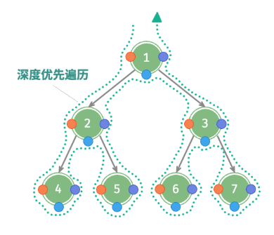
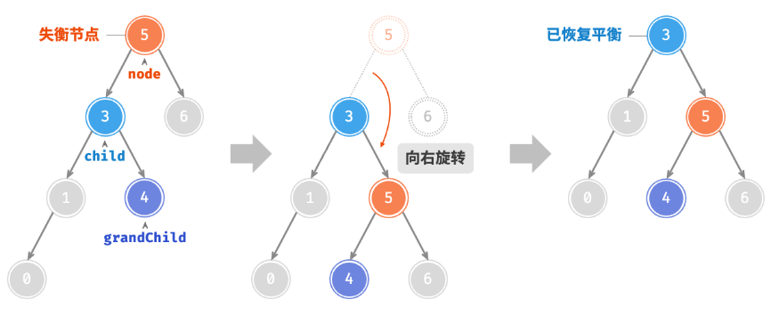

# Hello Algorithm
> **<span style="font-size: 18px;">[hello-algo](https://www.hello-algo.com/)</span>**

## 复杂度分析
- 迭代: 是一种重复执行某个任务的控制结构. 再跌贷中, 程序会在满足一定的条件下重复执行某段代码, 直到这个条件不再满足.
  - `for循环`
  - `while循环`
  - `嵌套循环`
- 递归: 是一种算法策略, 通过函数调用自身来解决问题.
  - 递: 程序不断深入地调用自身, 通常传入更小或更简化的参数, 直到达到"控制条件".
  - 归: 触发"终止条件"后, 程序从最深层的递归函数开始逐层返回, 汇聚每一层的结果.
- 递归: 自上而下地解决问题. 将原本问题分解为更小的子问题, 这些子问题和原问题具有相同的形式.
  - 递归通常比迭代更加耗费内存空间. 因为每次调用自身都会开辟新的函数分配内存.
  - 普通递归
    - 当函数返回到上一层级的函数后, 需要继续执行代码, 因此系统需要保存上一层调用的上下文.
    - 求和操作是在"归"的过程中执行的, 每层返回后都要再执行一次求和操作.
  - 尾递归 
    - 递归调用是函数返回前的最后一个操作, 这意味着函数返回上一层级后, 无需继续执行其他操作, 因此系统无需保存上一层函数的上下文.
    - 求和操作在"递"的过程中执行, "归"的过程只需层层返回
- 迭代: 自下而上地解决问题. 从最基础的步骤开始, 然后不断重复或累加这些步骤, 直到任务完成.
```go
package main
// 普通递归
func getSum1(n int) int {
	if n == 1 {
		return 1
    }
	// 递: 递归调用, res的值需要一层一层深入下去才能得到
	res := getSum1(n-1)
	// 归: 返回结果
	return n + res
}

// 尾递归
func getSum2(n, res int) int {
  if n == 0 {
	  return res
  }
  // 尾递归调用, 当前函数已经结束然后进行到下一层, n-1, res+n的值都是确定的
  return getSum2(n-1, res+n)
}
```

### 时间复杂度
- 统计算法的运行时间不合理也不现实.
- 使用函数渐近上界, 通过`f(n)->O(f(n))`
- O(1) < O(logn) < O(n) < O(nlogn) < O(n2) < O(2n) < O(n!)
- 常数阶 < 对数阶 < 线性阶 < 线性对数阶 < 平方阶 < 指数阶 < 阶乘阶
- 最差时间复杂度, 最佳时间复杂度, 平均时间复杂度
### 空间复杂度
- 算法在运行过程中使用的内存空间主要包括以下几种
  - 输入空间: 用于存储算法的输入数据
  - 暂存空间: 用于存储算法在运行过程中的变量, 对象, 函数上下文等数据
    - 暂存数据
    - 栈帧空间
    - 指令空间
  - 输出空间: 用于存储算法的输出数据
- 只关注最差空间复杂度
- O(1) < O(logn) < O(n) < O(n2) < O(2n)
- 常数阶 < 对数阶 < 线性阶 < 平方阶 < 指数阶
- 指数阶常见于二叉树, 平方阶常见于矩阵和图, 线性阶常见于递归, 数组, 链表, 栈, 队列等元素数量与n成正比的, 对数阶常见于分支算法(归并排序)

## 数据结构
### 逻辑结构(线性/非线性)
> 揭示了数据元素之间的逻辑关系
- 数组和链表: 数据之间的线性关系
- 树: 祖先与后代之间的派生关系
- 图: 节点和边复杂的网络关系

### 物理结构(连续/分散)
> 反映了数据在计算机内存中的存储方式
- byte: 一个字节(byte)由8个比特(bit)组成, 可表示2的8次方个数字

### 数字编码
> 数字是以"补码"的形式存储在计算机中的
- 原码: 将数字的二进制表示的最高位视为符号位, 0表示正数, 1表示负数, 其余为表示数字的值
- 反码: 正数的反码与其原码相同, 负数的反码是对其原码除符号位外的所有位取反
- 补码: 正数的补码与原码相同, 负数的补码是在其反码的基础上加1
- 负数的原码不能直接用于运算
- 负零的补码与正零的补码相同, 规定特殊的补码1 000 0000 代表-128
- 根据IEEE754标准, float由三部分组成: 符号位, 指数位, 分数位

### 字符编码
- ASCII字符集: 使用一个字节的低7位表示一个字符, 最多表示128个不同的字符(英文字母大小写, 数字0-9, 标点符号, 控制字符)
- EASCII字符集: 在ASCII的7位上扩展到8位, 能够表示256个不同的字符
- GBK字符集: ASCII字符使用一个字节表示, 汉字使用两个字节表示, 是常用的中文字符集.
- Unicode字符集: 统一字符编码(各种语言的字符, 符号, 表情符号), 是一种字符集标准, 给每个字符分配一个编号(码点), 但并没有固定在计算机中如何存储这些字符码点
- UTF-8编码: 可变长的编码, 使用1到4个字节表示一个字符.
  - 长度为1字节的字符, 最高位设置为0, 其余设置为Unicode码点. Unicode可以兼容ASCII码.
  - 对于长度为n字节的字符
    - 将首个字节的高n位都设置为1、第n+1位设置为0(读取的时候有几个1就知道占用几个字节)
    - 从第二个字节开始, 将每个字节的高2位都设置为10, 其余所有位用于填充字符的Unicode码点
    - 10当做校验符, 是因为UTF-8规则, 不可能有字符的最高两位是10.
    - 假设一个字符的最高两位是10, 说明该字符的长度为1,对应ASCII码. 而ASCII码的最高位应该是0
- UTF-16: 使用2或4个字节表示一个字符. 所有的ASCII字符和常用的非英文字符, 都用2个字节表示; 少数字符需要用到2个字节表示.
- UTF-32: 每个字符都是用4个字节
- Go的`string`类型在内部使用UTF-8编码, `rune`类型, 表示单个Unicode码点.
- 文件存储或网络传输中, 通常使用UTF-8编码, 以达到最优的兼容性和空间效率.

## 数组与链表

### 数组
- 空间效率高: 连续的内存块
- 支持随机访问: O(1)时间复杂度
- 缓存局部性: 访问数组元素, 计算机也会加载周围的其他数据
- 插入与删除效率低
- 长度不可变: 扩容需要将所有数据复制到新数组
### 链表
- 存储链表的内存空间是分散的
- 单向链表
- 环形链表
- 双向链表
- 循环链表常用于需要周期性操作的场景, 比如操作系统的资源调度
  - 时间片轮转调度算法
  - 数据缓冲区
### 列表
- 动态数组
- 扩容机制

## 栈和队列
### 栈
> 先进后出
- push: 元素入栈
- pop: 栈顶元素出栈
- peek: 访问栈顶元素
- 应用
  - 浏览器中的后退与前进, 软件中的撤销与反撤销
  - 程序内存管理(函数)
### 队列
> 先入先出
- push: 元素入队, 即将元素添加至队尾
- pop: 队首元素出队
- peek: 访问队首元素
- 应用
  - 淘宝订单
  - 各类待办事项 
### 双向队列
> 可以在在头部和尾部进行添加或删除
- pushFirst: 将元素添加至队首
- pushLast: 将元素添加至队尾
- popFirst: 删除队首元素
- popLast: 删除队尾元素
- peekFirst: 访问队首元素
- peekLast: 访问队尾元素

## 哈希表
> 哈希表, 又称散列表
- 哈希函数计算过程
  1. 通过哈希算法hash()计算得到哈希值
  2. 将哈希值对数组取模, 获得key对应的数组索引index
- 相同哈希值的元素可以放入同一个桶中
- 通过扩容哈希表减少哈希冲突
- 负载因子: 哈希表的元素数量除以桶数量, 用于衡量哈希冲突的严重程度, 也常被作为哈希表扩容的触发条件
- 链式地址: 发生哈希冲突的元素链接到桶的后面, 每个桶存储一条链表
  - 占用空间增大
  - 查询效率降低
  - 长度过大可以转换为红黑树以提升查找性能
- 开放寻址: 通过多次探测处理哈希冲突. 容易产生聚集现象, 且不能直接删除元素.
  - 线性探测
  - 平方探测
  - 多次哈希
- 哈希算法
  - 确定性
  - 效率高
  - 均衡分布
- 对于密码学
  - 单向性: 无法根据输出值得到输入值
  - 抗碰撞性: 应当极其困难找到两个不同的输入, 使得它们的哈希值相同
  - 雪崩效应: 输入的微小变化应当导致输出的显著且不可预测的变化
- 哈希算法的设计: 当我们使用大质数作为模数时, 可以最大化的保证哈希值的均匀分布
  - 加法哈希
  - 乘法哈希
  - 异或哈希
  - 旋转哈希
- 常见的哈希算法
  - MD5(输出长度: 128bits)
  - SHA-1(输出长度: 160bits)
  - SHA-2(输出长度: 256/512bits), 安全等级高
  - SHA-3(输出长度: 224/256/384/512bits), 安全等级高

## 树

### 二叉树
> 非线性数据结构, 体现一分为二的分治逻辑
- 二叉树中, 除叶节点外, 其他所有节点都包含子节点和非空子树
- 叶节点: 没有子节点的节点, 两个指针均指向None
- 节点的层: 从顶至底递增, 根节点所在层为1.
- 节点的度: 节点的子节点的数量, 二叉树中, 读的取值范围是0, 1, 2.
- 二叉树的高度: 从根节点到最远叶节点所经过的边的数量.
- 节点的深度: 从根节点到该节点所经过的边的数量.
- 节点的高度: 从最远叶节点到该节点所经过的边的数量.
- 
- 完美二叉树(满二叉树): 所有层的节点都被完全填满. 在完美二叉树中, 叶节点的度为0, 其余所有节点的度都为2
- 完全二叉树: 最底层节点靠左填充, 其他层节点全被叶节点填满.
- 
- 完满二叉树: 除了叶节点之外, 其余所有节点都有两个子节点.
- 
- 平衡二叉树: 任意节点的左子树和右子树的高度之差的绝对值不超过1.

### 二叉树遍历



### 二叉树数组表示


### 二叉搜索树
> 对于根节点, 左子树中所有节点的值 < 根节点的值 < 右子树中所有的值, 任意节点的左右子树也是二叉搜索树.
- 二叉搜索树的中序遍历序列是升序的.
- 二叉搜索树的查找, 插入, 删除操作时间复杂度都为: `O(log n)`


### AVL树
> 即是二叉搜索树, 又是平衡二叉树, 同时满足这两类二叉树的所有性质, 也被成为平衡二叉搜索树.
- 插入和删除操作需要对avl树进行旋转操作
- 旋转: 右旋, 左旋, 先右旋后左旋, 先左旋后右旋.
- 
- 
- 
- 
- 应用
  - 组织和存储大型数据, 适用于高频查找, 低频增删的场景.
  - 用于构建数据库中的索引系统.
  - 红黑树在许多应用中比AVL树更受欢迎. 这是因为红黑树的平衡条件相对宽松, 在红黑树中插入与删除节点所需的旋转操作相对较少，其节点增删操作的平均效率更高.


## 堆
> 堆是一种满足特定条件的完全二叉树, 分为大顶堆和小顶堆.


- 堆常见应用
- 优先队列
- 堆排序
- 获取最大的k个元素
- 给定索引i, 其左子节点索引为2i+1, 右子节点索引为2i+2, 父节点索引为(i-1)/2(向下取整), 索引越界表示空节点或节点不存在.

## 图
> 图是一种非线性数据结构, 由顶点和边组成.
- 根据边是否有方向, 图可以分为无向图和有向图
  - 无向图的边表示两顶点之间的"双向"关系
  - 有向图的边具有方向性
- 根据所有顶点是否连通, 可以分为连通图和非连通图.
  - 连通图从某个顶点出发, 可以到达其余任意顶点.
  - 非连通图从某个顶点出发, 至少有一个顶点无法到达.
- 根据边有无权重, 可以分为无权图和有全图
  -比如王者中根据共同游戏时间计算玩家之间的亲密度, 这种亲密网络可以用有全图来表示
- 常用术语
  - 邻接: 两顶点之间存在边相连
  - 路径: 从顶点A到顶点B经过的边构成的序列
  - 读: 一个顶点拥有的边数. 有向图还有入度和出度
- 
- 
- 常见应用
  - 社交网络: 顶点: 用户; 边: 好友关系; 图计算问题: 潜在好友推荐.
  - 地铁线路: 顶点: 站点; 边: 站点间的连通性; 图计算问题: 最短路线推荐.
  - 太阳系: 顶点: 星体; 边: 星体间的万有引力作用; 图计算问题: 行星轨道计算.
- 邻接表: 以时间换空间
- 邻接矩阵: 以空间换时间
- 广度优先遍历: 由近及远, 从某个节点出发, 始终优先访问距离最近的顶点, 并一层层向外扩张.
- 
- 深度优先遍历: 优先走到底, 无路可走再回头.