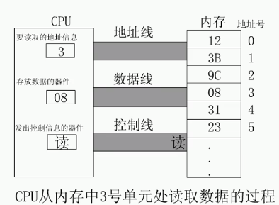
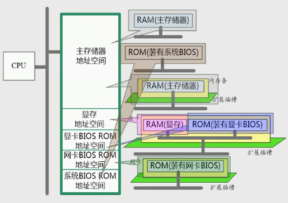
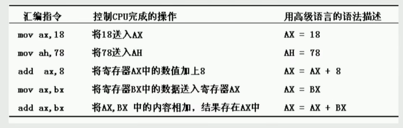

- **机器语言**是机器指令的集合
- **机器指令**是一台机器可以正确执行的命令
- 汇编语言的主体是汇编指令
- 汇编指令和机器指令的差别在于指令的表示方式上
  - 汇编指令是机器指令便于记忆的书写格式
  - 汇编指令是机器指令的<u>助记符</u>

- 工作过程： 汇编指令-->编译器-->机器码
- 伪指令： 由编译器执行
- 符号：由编译器执行
- 数据表示：二进制(B)、十六进制(H)、八进制(o)、十进制(D)
- 存储器被划分为若干个存储单元,每个存储单元从0开始编号
  - n条数据总线 ,寻址空间2的n次方个**字节**
- 1MB=1024KB=1024B*1024B
  - 1B就是1Byte就是一个字节
  - 1B=1Byte=8bit=8位
  - **<u>计算机以一个字节为寻址单位</u>**

####  总线
> 连接CPU和其他芯片

- 物理上：一根根导线的集合
- 逻辑上：
  - ==地址总线==：指定存储单元，地址总线宽度决定了可寻址的存储单元大小，单向，宽度决定可寻址的存储单元大小
  - ==数据总线==：CPU与内存和其他器件之间的数据传送。宽度决定了CPU和外接数据传送速度，双向
  - ==控制总线==：CPU通过控制总线对外部器件进行控制，是一些不同控制总线的集合，宽度决定对外部器件 的控制能力，双向

#### CPU对存储器的读写
> 三类信息交互

- 存储单元的地址：地址信息
- 器件的选择，读或写命令：控制信息
- 读或写的数据：数据信息

#### 内存地址空间
>  CPU地址总线宽度为N，寻址空间位2的N次方B，即为内存地址空间

- RAM: 断电丢失,  可读可写，主板上的，扩展槽上的RAM（显卡 ）
- ROM: read only，系统的BIOS，接口卡上的BIOS

#### 将各类存储器看做一个逻辑存储器---统一编址

- 所有的物理存储器被看做一个由若干存储单元 组成的逻辑存储器
- 每个物理存储器在这个逻辑存储器上占有一个地址段，即一段地址空间 
- CPU在这段地址空间中读写数据，实际上就是在相对应的物理存储器中读写数据

## 环境搭建
> 8086

- 实践方案：**DOS环境**
- DOS: DOSBox，模拟器

## 寄存器
### 寄存器及数据存储
- CPU
  - 运算器: 信息处理
  - 寄存器: 信息存储
  - 控制器: 协调各种器件进行工作
  - 内部总线实现CPU内各个器件之间的联系
- 通用寄存器均可以分为两个独立的寄存器使用(高八位+低八位).
  - AX可以分为AH和AL
  - BX可以分为BH和BL
  - CX可以分为CH和CL
  - DX可以分为DH和DL
- 8086是16位CPU
  - 字长为16bit(数据总线的宽度)
- 一个字(word)可以存在一个16位寄存器中
  - 字的高位字节存在寄存器的高8位
  - 字的低位字节存在寄存器的低8位

### mov和add指令
- 
- 汇编指令不区分大小写
- 低位相加以及高位相加时如果溢出会舍弃而不是进位

### 确定物理地址的方法
- CPU访问内存单元时要给出内存单元的地址.
- 所有的内存单元构成的存储空间是一个一维的线性空间.
- 每一个内存单元在这个空间中都有唯一的地址, 这个唯一的地址称为物理地址.
- 地址加法器合成物理地址的方法
  - 物理地址=段地址(基地址)*16[*16就是左移4位]+偏移地址
  - 用两个16位的地址(段地址+偏移地址), 相加得到一个20位的物理地址

### 内存的分段表示
- 内存没有分段, 段的划分来自于CPU, 是逻辑上的.
- 同一段内存, 多种分段方案
- 段地址*16一定是16的倍数, 所以一个段的起始地址也一定是16的倍数.
- 偏移地址为16位, 16位地址的寻址能力为64k, 所以一个段的长度最大为64k.
- 同一个物理地址可以由不同的段地址和偏移地址形成.
- 段寄存器
  - CS: 代码段寄存器(code)
  - DS: 数据段寄存器(data)
  - SS: 栈段寄存器(stack)
  - ES: 附加段寄存器