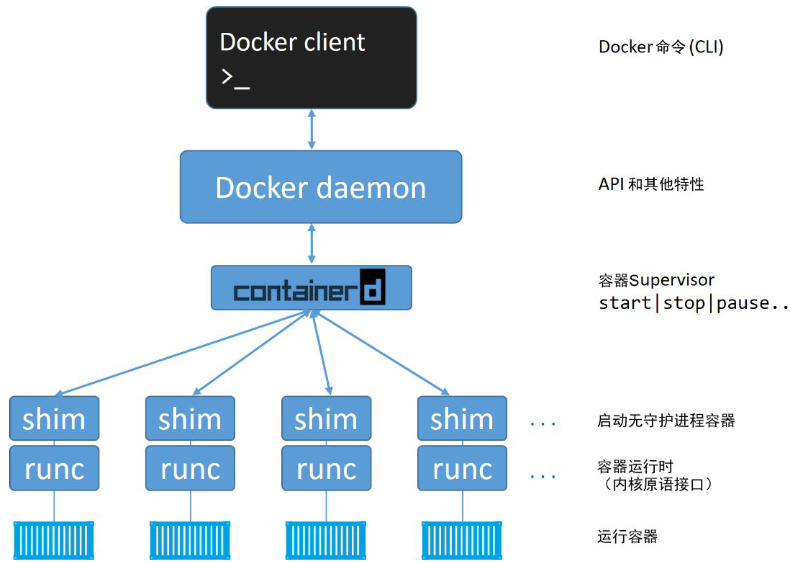
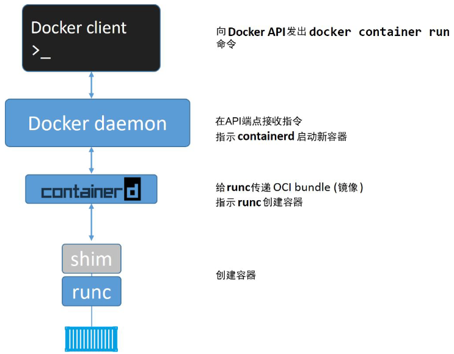
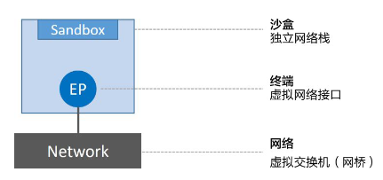
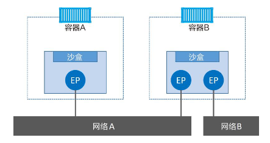
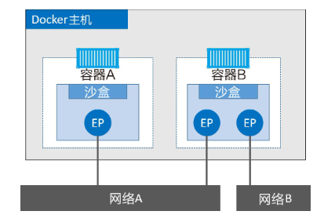
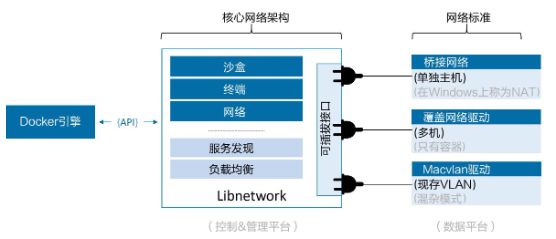
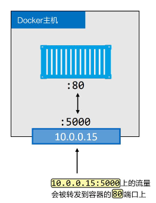
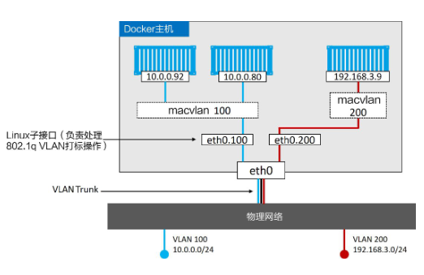
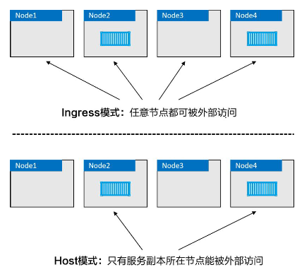

# 深入浅出Docker

## 概览
- 对容器发展影响大的技术
  - 内核命名空间(Kernel Namespace)
  - 控制组(Control Group)
  - 联合文件系统(Union File System)
- 实现容器所需的核心Windows内核技术被统称为Windows容器(Windows Container), 用户空间是通过Docker来完成与Windows容器之间交互的
- 运行中的容器共享主机的内核.
- kubernetes提供了一个可插拔的容器运行时接口CRI
- Docker用于创建, 管理和编排容器.
- Docker Engine是用于运行和编排容器的基础设施工具. Docker Engine是运行容器的核心容器运行时.
- Docker开源项目(Moby)
- 开放容器计划: The Open Container Initiative(OCI): 是一个旨在对容器基础架构中的基础组件进行标准化的管理委员会.
  - 镜像规范
  - 运行时规范
- 升级docker
  - 停止docker守护程序
  - 移除旧版本docker
  - 安装新版本docker
  - 配置新版本的docker为开机自启动
  - 确保容器重启成功
- `docker system info` 查看docker存储驱动, 包括client和server相关配置信息
  - Docker的`Device Mapper`存储驱动利用Lvm实现
  - `Device Mapper`: 存储驱动, 使用**direct-lvm**
  - LVM: logical volume manager
  - ```json
    {
      "storage-driver": "devicemapper",
      "storage-opts": [
        "dm.directlvm_device=/dev/xdf",
        "dm.thinp_percent=95", 
        "dm.thinp_metapercent=1",
        "dm.thinp_autoextend_threshold=80", 
        "dm.thinp_autoextend_percent=20",  
        "dm.directlvm_device_force=false"
      ]
    }  
    ```
- docker: docker client和docker daemon(有时也被成为服务端/server或引擎/engine)
  - daemon实现了docker engine的api
  - Linux: client和daemon之间的通信是通过本地IPC/UNIX socket完成的(/var/run/docker.sock)
  - Windows: 通过npipe://// ./pipe/docker_engine的管道来完成的.
## Docker基本命令
- ```shell
  docker image ls
  # it参数会将shell切换到容器终端, 开启容器的交互模式并且用户当前shell连接到容器终端
  docker container run -it
  # 退出容器的同时保持容器运行, 不会杀死容器进程
  Ctrl -PQ
  docker container ls
  docker container exec -it
  docker container stop
  docker container rm
  ```

## Docker Engine
> 用来运行和管理容器的核心软件
- 
- 组成: Docker Client, Docker daemon, containerd, runc
- Docker daemon: API和其他特性, 不再包含任何容器运行时的代码, 所有的容器运行代码在一个单独的OCI兼容层(runc)来实现
  - daemon使用一种CRUD风格的api, 通过grpc与containerd进行通信
  - 镜像管理, 镜像构建, REST API, 身份验证, 安全, 核心网络以及编排
- containerd: 容器的生命周期管理, 镜像管理等
  - containerd将Docker镜像转换为OCI bundle, 并让runc基于此创建一个新的容器
  - 然后runc与操作系统内核接口进行通信, 基于所有必要的工具来创建容器
  - 容器进程作为runc的子进程启动, 启动完毕后, runc自动退出
  - **已成为kubernetes中默认的常见的容器运行时**
- 
- 将所有的用于启动, 管理容器的逻辑和代码从daemon中移除, 意味着容器运行时与Docker daemon是解耦的, 有时称之为"无守护进程的容器"
  - 旧模型中, 所有容器运行时的逻辑都在daemon中实现, 启动和停止daemon都会导致宿主机上所有运行中的容器被砍掉.
- shim: 实现无daemon容器
  - 每次创建一个容器时containerd会fork一个runc实例, 创建完毕, 对应的runc进程就会退出(因此即使运行上百个容器, 也无需保持上百个运行中的runc实例)
  - 一旦容器进程的父进程runc退出, 相关联的containerd-shim进程就会成为容器的父进程.
    - 保持所有的STDIN和STDOUT流是开启状态,从而当daemon重启的时候, 容器不会因为管道的关闭而终止
    - 将容器的退出状态反馈给daemon
- runc: 默认的容器运行时, 实质上是一个轻量的, 针对Libcontainer进行了包装的命令行交互工具, 作用是创建容器
  - runc所在那一层称为OCI层

## Docker Image
- 镜像有多个层组成, 每层叠加之后, 从外部看来如同一个独立的对象.
- 镜像内部是一个精简的操作系统, 同时还包含着应用运行所必须的文件和依赖包.
- Docker镜像追求快速和小巧, 构建镜像时会才减掉不必要的东西.
  - 通常Docker镜像中只有一个精简的shell, 甚至没有shell.
  - 镜像中不包含内核: **容器都是共享宿主机的内核**
  - 容器仅包含必要的操作系统(通常只有操作系统文件和文件系统对象)
- 本地镜像仓库: `/var/lib/docker/<storage-driver>`
- `docker image pull repository:tag`
- `docker image ls` 
  - `-a --all`: 显示所有的镜像(默认隐藏中间镜像)
     - `--digests`: 显示摘要
  - `-f --filter [filter]`: 基于给定的条件过滤输出
     `--format [string]`: 使用自定义模板格式化输出: `docker image ls --format "{{.Size}}"`
        table: 表格
        table TEMPLATE: 使用给定的Go模板
        json: 使用json格式
        TEMPLATE: 使用被给定的Go模板
     --no-trunc: 不要截断输出
  - `-q --quiet`: 只显示镜像id
  - filter
    - dangling [bool]: 是否返回悬虚镜像
    - before: 需要镜像名称或者ID作为参数, 返回在之前被创建的全部镜像
    - since: 与before类似, 不过返回的是指定镜像之后创建的全部镜像
    - label: 根据标注(label)的名称或者值, 对镜像进行过滤. docker image ls命令输出中不显示标注内容
    - reference: 其他过滤方式, 比如: `docker image ls --filter=reference="*:latest"`
- `docker image pull [OPTIONS] NAME[:TAG|@DIGEST]`
  - `alias: docker image ls, docker image list, docker images`
  - `-a --all-tags`: 下载仓库中所有打标签的镜像
    - `--disable-content-trust`: 跳过镜像验证
    - `--platform [string]`: 如果服务器支持多平台, 则设置平台
  - `-q --quiet`:    抑制详细输出
- `docker image prune`: 移除全部的悬虚镜像

- 镜像可以有多个标签, latest不一定是最新的镜像
- 没有标签的镜像被称为悬虚对象: `<none>:<none>`, 原因是构建了一个新镜像, 然后为该镜像打了一个已经存在的标签.
- docker search命令允许通过cli的方式搜索docker hub
  - `docker search alpine --filter "is-official=true"`
  - 官方: `docker search alpine --filter=is-official=true`
  - 自动创建的仓库: `docker search alpine --filter=is-automated=true`
  - 增加返回的行数: `--limit=xx`
- 镜像由一些松耦合的只读镜像层组成. docker负责堆叠这些景象层, 并且将他们表示为单个统一的对象.
- `docker image inspect container`
- 所有的docker镜像都起始于一个基础镜像层, 当进行修改或增加新的内容时, 就会在当前镜像层之上, 创建新的镜像层.
- Docker通过存储引擎(新版本通过快照机制)的方式来实现镜像层堆叠, 并保证多镜像层对外展示为统一的文件系统.
- Linux上可用的存储引擎
  - AUFS
  - Overlay2
  - Device Mapper
  - Btrfs
  - ZFS
- 多个镜像之间可以并且确实会共享镜像层, 节省空间+提升性能
- Docker在Linux上支持很多存储引擎(snapshotter), 每个存储引擎都有自己的镜像分层, 镜像层共享以及写时复制(COW)技术的具体实现
- 每个镜像都有单独的签名(digest)
- 镜像层之间是完全独立的, 是实际数据存储的地方
- 镜像的唯一标识是一个加密ID, 即配置对象本身的散列值. 每个镜像层也由一个加密ID区分, 值为镜像层本身内容的散列值
- 镜像内容或其中任意的镜像层发生改动, 都会导致散列值变化, 这就是内容散列(content hash)
- 为了避免压缩带来的散列改变, 每个镜像层还回包含一个分发散列值(压缩版镜像的散列值). 用于校验拉取的镜像是否被篡改过.
- Manifest: 某个镜像标签支持的架构列表
- 多架构镜像
- 删除操作会在当前主机上删除该镜像以及相关的镜像层.
- 如果某个镜像层被多个镜像共享, 那只有当全部依赖该镜像层的镜像都被删除后, 该镜像层才会被删除.

## Docker Container

- **容器会共享宿主机的操作系统/内核**
- Hypervisor是**硬件虚拟化**, 将硬件物理资源划分为虚拟资源
- 容器是**操作系统虚拟化**, 容器将系统资源划分为虚拟资源
- 对比虚拟机
  - 只需要一个OS需要授权
  - 只有一个OS需要升级和打补丁
  - 只有一个OS消耗CPU, RAM和存储资源
  - **容器内部并不需要内核**, 也就没有定位, 解压以及初始化的过程. 也不需要在内核启动过程中对硬件的遍历和初始化.
- `systemctl is-active docker`
- docker run之后, 查询本地缓存, 如果没有查询docker hub, 本地有了镜像之后, daemon就会创建容器
- **容器如果不运行任何进程则无法存在--杀死Bash Shell即杀死了容器唯一运行的进程, 导致这个容器也被杀死**
- `Ctrl-PQ` 会退出容器但不终止容器运行.
- 停止容器运行并不会损毁
- 优雅停止容器: `docker container stop, docker container rm`, stop命令向容器内的PID1进程发送SIGTERM信号, 10s内进程没有终止, 会受到SIGKILL信号
- 重启策略: `always`,`unless-stopped`, `on-failed`
  - `--restart always`: daemon重启的时候, 停止的容器也会被重启.
  - `--restart on-failure`: 退出容器并且返回值不是0的时候, 重启容器.
  - `--restart unless-stopped`: 正常退出和异常退出都会重启, 使用`docker stop`不会重启

## 应用容器化
- `FROM`: 指令指定的镜像会作为当前镜像的一个基础镜像层, 当前应用的剩余内容会作为新增镜像层添加到基础镜像层之上.
- `LABEL`: 为当前镜像添加一些信息, 每个标签都是k-v结构的.
- `RUN`: 在FROM指定的基础镜像之上, 新建一个镜像层来存储这些安装内容.
- `COPY`: 将应用文件复制到惊险中, 并且新建一个镜像层来存储.
- `WORKDIR`: 指定工作目录, 作为元数据记录到镜像配置中, 但不会创建新的镜像层.
- `EXPOSE`: 完成响应端口的设置.
- `ENTRYPOINT`: 指定当前镜像的入口程序, 指定的配置信息也通过镜像元数据的形式保存, 不会新增镜像层.
- `docker image history`: 查看构建镜像的过程中执行的指令.
- 多阶段构建方式使用一个Dockerfile, 其中包含多个`FROM`指令. 每一个`FROM`指令都是一个新的构建阶段(build stage).
- `COPY --from`: 会从之前的构建阶段的镜像中仅复制生产环境相关的应用代码, 而不会复制生产环境不需要的部分.
- Docker的构建过程利用了缓存机制.
- `docker image build`命令从顶层开始解析Dockerfile中的指令并逐行执行.
- `no-install-recommends`: apt只会下载核心依赖包, 而不是推荐和建议的包.

## 使用`Docker Compose`部署应用
- `Docker Compose`: 使用声明式的yaml文件定义多服务的应用.
- Docker Compose默认创建bridge网络.
- `build`: 基于Dockerfile构建

## Docker Swarm
- `Swarm`将一个或多个Docker节点组织起来, 使得用户能够以集群方式管理它们.
- 集群方面: 内置有加密的分布式集群存储, 加密网络, 公用tls, 安全集群接入令牌以及一套简化数字证书管理的pki. 用户可以自如地添加或删除节点
- 编排方面: Swarm提供了一套丰富的api使得部署和管理复杂的为服务应用变得易如反掌. 通过将应用定义在声明式配置文件中, 就可以使用原生的Docker命令完成部署
- 一个Swarm由一个或多个Docker节点组成. 节点会被配置为管理节点或工作节点.
- 管理节点负责集群控制面, 监控集群状态, 分发任务至工作节点等.
- 工作节点接收来自管理节点的任务并执行.
- Swarm的配置和状态信息保存于etcd中.
- 部署奇数个管理节点: 减少脑裂
- 不要部署太多管理节点(3个或5个).
- 重启一个旧的管理节点或进行备份恢复仍有可能对集群造成影响. docker提供了自动锁机制锁定swarm
- 服务的默认复制模式是副本模式, 会部署期望数量的服务副本, 尽可能将副本均匀分布在整个集群中
- 全局模式: 每个节点上仅运行一个副本.
- 滚动升级

## Docker网络
- Libnetwork是Docker对CNM(container network model)的一种实现, 提供了Docker核心网络架构的全部功能. 不同的驱动可以通过插拔的方式接入Libnetwork来提供定制化的网络拓扑.
- Docker封装了一系列本地驱动
  - 单机桥接网络(Single-Host Bridge Network)
  - 多机覆盖网络(Multi-Host Overlay)
  - 支持接入现有VLAN
- Libnetwork提供了本地服务发现和基础的容器负载均衡解决方案.
- CNM是设计标准, 规定了Docker网络架构的基础组成要素.
  - 
  - 
  - 
  - 容器A和容器B运行在同一个主机上, 但其网络堆栈在操作系统层面是互相独立的, 这一点由沙盒机制保证.
  - 终端与常见的网络适配器类似, 只能接入某一个网络. 如果需要接入到多个网络, 需要多个终端.
  - **沙盒**(sandbox)是一个独立的网络栈, 包括以太网接口, 端口, 路由表以及DNS配置.
  - **终端**(endpoint)是虚拟网络接口, 主要负责创建连接.CNM中, 终端负责将沙盒链接到网络
  - **网络**(network)是802.1d网桥的软件实现, 是需要交互的终端的集合, 终端之间相互独立.
- Libnetwork是CNM的具体实现, 被Docker采用. 使用Golang编写, 实现了CNM中列举的核心组件.
- 驱动通过实现特定网络拓扑的方式来扩展该模型的能力. 负责所有网络资源的创建和管理
  - 负责实现数据层, Docker封装了若干内置驱动, 通常被称作原生驱动或本地驱动.
  - linux: bridge, overlay, macvlan
  - windows: nat, overlay, transport, l2 bridge
  - 第三方远程驱动: calico, contiv, kuryr以及weave
  - 
- 单机桥接网络
  - 单机: 意味着该网络只能在单个Docker主机上运行, 并且只能与所在Docker主机上的容器进行连接
  - 桥接: 意味着这是802.1.d桥接的一种实现(二层交换机)
  - Linux主机上, Docker网络由bridge驱动创建, bridge底层是基于Linux内核中久经考验达15年之久的Linux Bridge技术
  - 创建一个bridge网络, 还会在主机内核中创建一个新的Linux网桥.
  - 
- 多机覆盖网络
  - 允许单个网络覆盖多个主机, 不同主机上的容器间就可以在链路层实现通信.覆盖网络是理想的容器间通信方式, 支持完全容器化的应用, 并且具有良好的伸缩性.
  - macvlan
    - 性能优异, 无需端口映射或者额外桥接, 可以直接通过主机接口(子接口)访问容器接口.
    - 缺点是需要将主机网卡(nic)设置为混杂模式(promiscuous), 公有云不可行
    - 
- 每个Docker主机为容器提供了默认的日志驱动以及配置
- 容器日志生效的前提是应用进程在容器内部PID为1, 并且将正常日志输出到STDOUT，将异常日志输出到STDERR. 日志驱动就会将这些"日志"转发到日志驱动配置指定的位置
- 服务发现允许容器和Swarm服务通过名称相互定位. 唯一要求是需要处于同一个网络中.
- Docker内置dns服务器, 为每个容器提供dns解析功能.
- Swarm支持两种服务发布模式, 两种模式均保证服务从集群外可以访问.
  - ingress模式(默认): 采用service mesh或者swarm mode service mesh的四层路由网络来实现
  - host模式
  - 
- Docker使用Libnetwork实现了基础服务发现功能, 同时还实现了服务网格, 支持对入站流量实现容器级别负载均衡.

# 命令

## `docker container COMMAND`
- `attach`: 将本地标准输入, 输出和错误流附加到正在运行的容器
- `commit`: 根据容器的更改创建一个新镜像
- `cp`: 在容器和本地文件系统之间复制文件/文件夹
  - docker container cp [OPTIONS] 容器:源路径 目标路径|-
  - `-`表示从标准输入读取一个tar, 解压到容器的指定目录
  - docker cp [OPTIONS] 源路径|- 容器:目标路径
  - `-`从标准输入读取一个tar, 流式传输到容器中
  - `cat file.txt | docker container cp - my_container:/app`
  - `-a, --archive`: 存档模式, 复制所有的uid/gid信息
  - `-L, --follow-link`: 总是跟随源路径中的符号链接
  - `-q, --quiet`: 在复制过程中抑制进度输出, 如果没有附加终端, 自动抑制进度输出.
- `create` 创建一个新容器
- `diff`: 检查容器文件系统中文件或目录的更改
- `exec`: 在正在运行的容器中执行命令
  - usage: docker exec [OPTIONS] CONTAINER COMMAND [ARG...]
  - -d(--detach): 分离模式, 在后台运行命令;
  - --detach-keys [string]: Override the key sequence for detaching a container
  - -e(--env) [list]: 设置环境变量
    - --env-file [list]: 从文件中读取环境变量
  - -i(--interactive): 即使没有连接, 也要保持运行.
    - --previleged: 为命令授予权限
  - -t(--tty): 分配一个伪终端
  - -u(--user) [string]: 用户名或uid(format: "<name|uid>[:<group|gid>]")
  - -w(--workdir) [string]: 容器内工作/运行目录
- `export`: 将容器的文件系统导出为一个tar存档
- `inspect`: 显示一个或多个容器的详细信息
- `kill`: 终止一个或多个正在运行的容器
- `logs`: 获取容器的日志
- `ls`: 列出容器
  - usage: `docker container ls [OPTIONS]`
  - aliases: `docker container ls, docker container list, docker container ps, docker ps`
  - `-a, -all`: 展示所有的容器(默认只展示正在运行的)
  - `-f, --filter [filter]`
  - `-- format [string]`: table, table TEMPLATE, json, TEMPLATE
- `pause`: 暂停一个或多个容器内的所有进程
- `port`: 列出容器的端口映射或特定映射
  - usage: `docker container port CONTAINER [PRIVATE_PORT[/PROTO]]`
  - aliases: `docker container port, docker port`
- `prune`: 删除所有已停止的容器
- `rename`: 重命名一个容器(停止的容器也可以)
- `restart`: 重新启动一个或多个容器
- `rm`: 删除一个或多个容器
- `run`: 从一个镜像创建并运行一个新容器
- `start`: 启动一个或多个已停止的容器
- `stats`: 显示容器(s)资源使用统计的实时流
- `stop`: 停止一个或多个正在运行的容器
- `top`: 显示一个容器的运行进程
- `unpause`: 恢复一个或多个容器内的所有进程
- `update`: 更新一个或多个容器的配置
- `wait`: 阻塞, 直到一个或多个容器停止, 然后打印它们的退出状态码


## `docker compose [options] COMMAND`
### options
- `--ansi string`: 控制何时打印ANSI控制字符never, always, auto(default)

## docker swarm 
- `init`: initialize a swarm
- `join`: join a swarm as a node or a manager
- `ca`: display and rotate the root CA
- `join-token`: manage join tokens
- `leave`: leave the swarm
- `unlock`: unlock swarm
- `unlock-key`: manage the unlock key
- `update`: update the swarm
## docker service
- `ls`
- `ps`