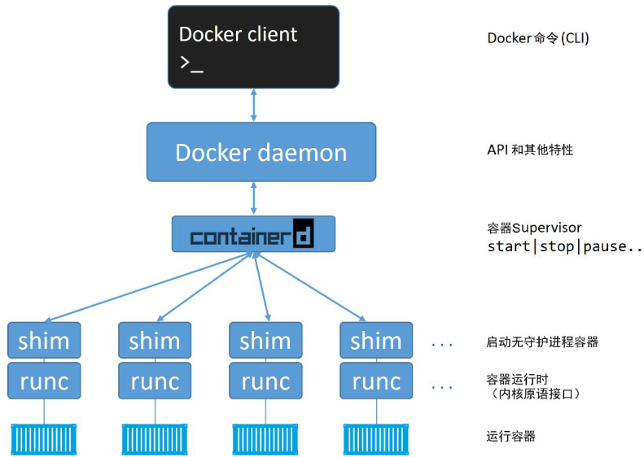
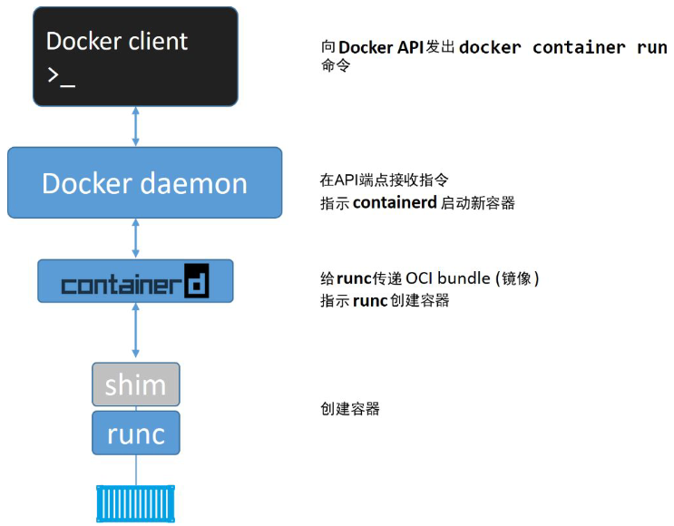

# 深入浅出Docker

## 概览
- 对容器发展影响大的技术
  - 内核命名空间(Kernel Namespace)
  - 控制组(Control Group)
  - 联合文件系统(Union File System)
- 实现容器所需的核心Windows内核技术被统称为Windows容器(Windows Container), 用户空间是通过Docker来完成与Windows容器之间交互的
- 运行中的容器共享主机的内核.
- kubernetes提供了一个可插拔的容器运行时接口CRI
- Docker用于创建, 管理和编排容器.
- Docker Engine是用于运行和编排容器的基础设施工具. Docker Engine是运行容器的核心容器运行时.
- Docker开源项目(Moby)
- 开放容器计划: The Open Container Initiative(OCI): 是一个旨在对容器基础架构中的基础组件进行标准化的管理委员会.
  - 镜像规范
  - 运行时规范
- 升级docker
  - 停止docker守护程序
  - 移除旧版本docker
  - 安装新版本docker
  - 配置新版本的docker为开机自启动
  - 确保容器重启成功
- `docker system info` 查看docker存储驱动, 包括client和server相关配置信息
  - Docker的`Device Mapper`存储驱动利用Lvm实现
  - `Device Mapper`: 存储驱动, 使用**direct-lvm**
  - LVM: logical volume manager
  - ```json
    {
      "storage-driver": "devicemapper",
      "storage-opts": [
        "dm.directlvm_device=/dev/xdf",
        "dm.thinp_percent=95", 
        "dm.thinp_metapercent=1",
        "dm.thinp_autoextend_threshold=80", 
        "dm.thinp_autoextend_percent=20",  
        "dm.directlvm_device_force=false"
      ]
    }  
    ```
- docker: docker client和docker daemon(有时也被成为服务端/server或引擎/engine)
  - daemon实现了docker engine的api
  - Linux: client和daemon之间的通信是通过本地IPC/UNIX socket完成的(/var/run/docker.sock)
  - Windows: 通过npipe://// ./pipe/docker_engine的管道来完成的.
## Docker基本命令
- ```shell
  docker image ls
  # it参数会将shell切换到容器终端, 开启容器的交互模式并且用户当前shell连接到容器终端
  docker container run -it
  # 退出容器的同时保持容器运行, 不会杀死容器进程
  Ctrl -PQ
  docker container ls
  docker container exec -it
  docker container stop
  docker container rm
  ```
- `docker exec`: execute a command in a running container
  - usage: docker exec [OPTIONS] CONTAINER COMMAND [ARG...]
  - aliases: docker container exec, docker exec
  - -d(--detach): 分离模式, 在后台运行命令;
  - --detach-keys [string]: Override the key sequence for detaching a container
  - -e(--env) [list]: 设置环境变量
  - --env-file [list]: 从文件中读取环境变量
  - -i(--interactive): 即使没有连接, 也要保持运行.
  - --previleged: 为命令授予权限
  - -t(--tty): 分配一个伪终端
  - -u(--user) [string]: 用户名或uid(format: "<name|uid>[:<group|gid>]")
  - -w(--workdir) [string]: 容器内工作/运行目录


## Docker Engine
> 用来运行和管理容器的核心软件
- 
- 组成: Docker Client, Docker daemon, containerd, runc
- Docker daemon: API和其他特性, 不再包含任何容器运行时的代码, 所有的容器运行代码在一个单独的OCI兼容层(runc)来实现
  - daemon使用一种CRUD风格的api, 通过grpc与containerd进行通信
  - 镜像管理, 镜像构建, REST API, 身份验证, 安全, 核心网络以及编排
- containerd: 容器的生命周期管理, 镜像管理等
  - containerd将Docker镜像转换为OCI bundle, 并让runc基于此创建一个新的容器
  - 然后runc与操作系统内核接口进行通信, 基于所有必要的工具来创建容器
  - 容器进程作为runc的子进程启动, 启动完毕后, runc自动退出
  - **已成为kubernetes中默认的常见的容器运行时**
- 
- 将所有的用于启动, 管理容器的逻辑和代码从daemon中移除, 意味着容器运行时与Docker daemon是解耦的, 有时称之为"无守护进程的容器"
  - 旧模型中, 所有容器运行时的逻辑都在daemon中实现, 启动和停止daemon都会导致宿主机上所有运行中的容器被砍掉.
- shim: 实现无daemon容器
  - 每次创建一个容器时containerd会fork一个runc实例, 创建完毕, 对应的runc进程就会退出(因此即使运行上百个容器, 也无需保持上百个运行中的runc实例)
  - 一旦容器进程的父进程runc退出, 相关联的containerd-shim进程就会成为容器的父进程.
    - 保持所有的STDIN和STDOUT流是开启状态,从而当daemon重启的时候, 容器不会因为管道的关闭而终止
    - 将容器的退出状态反馈给daemon
- runc: 默认的容器运行时, 实质上是一个轻量的, 针对Libcontainer进行了包装的命令行交互工具, 作用是创建容器
  - runc所在那一层称为OCI层