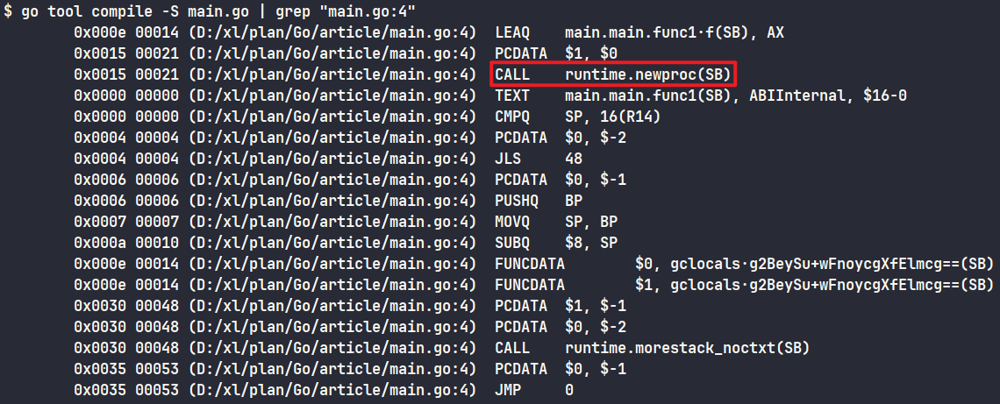

# Go调度的本质是一个生产-消费流程
- 生产数的goroutine放到可运行队列中
  - runnext: 只能只想一个goroutine, 是一个特殊的队列.
  - local queue: 大小为256的数组, 实际上用head和tail指针把它当成一个环形数组使用.
  - global queue
- 如果runnext为空, goroutine顺利放入runnext, 以最高优先级得到运行, 优先被消费.
- Go程序启动创建P, 创建初始的m0, m0启动一个调度循环, 不断地找g, 运行, 再找g
- 随程序运行, m更多地被创建出来, 生产者不断地生产g, m的调度循环不断地消费g

# 迷惑的goroutine执行顺序
```go
func main() {
	runtime.GOMAXPROCS(1)
	for i := 0; i < 10; i++ {
		go func(i int) {
			fmt.Println(i)
		}(i)
	}
	time.Sleep(1 * time.Second)
}
// 顺序是9,0,1,2,3,4,5,6,7,8
```
- 本地只有一个p,for循环中生产出的goroutine都会进入到p的runnext和local queue
  - i从1开始, runnext已经有goroutine在了, 这是会把old goroutine移到p的本地队列中, 再把new goroutine放到runnext中, 重复这个过程.
  - 最后i为9, 新goroutine被放到runnext, 其余goroutine都在本地队列.
- go1.13的time包生产一个timerproc的goroutine用于唤醒挂在timer上的时间未到期的goroutine.
- go1.14去掉了这个用于唤醒的goroutine, 取而代之在调度循环的各个地方, sysmon里都是唤醒timer的代码, timer唤醒更及时.

# 如何用汇编打同事的脸
- `go tool compile -S main.go`: 将源代码编译成.o文件, 并输出汇编代码
- `go build main.go && go tool objdump ./main`: 反汇编, 从可执行文件反编译成汇编
```go
package main

func main() {
	go func() {
		println(1+2)
    }()
}
```
- 查找go关键字对应runtime里哪个函数
  - `go tool compile -S main.go | grep "main.go:4"`
  - `go build main.go && go tool objdump ./main | grep "main.go:4"`
- 
- 
```go
package main

func main() {
  var m map[int]int
  m[1] = 1
}

go build mian.go
dlv exec ./mian.exe
// 打断点
b mian.go:5
// continue
c
// 展示汇编代码
disass
// step in
si
// next 进入到函数中
n
```

# 初识AST的威力
> abstract syntax tree
- 
```go
func main() {
	m := map[string]int{"orders": 10000, "driving_years": 18}
	rule := "orders > 1000 && driving_years > 5"
	fmt.Println(Eval(m, rule))
}

func Eval(m map[string]int, expr string) (bool, error) {
	// 解析表达式
	exprAst, err := parser.ParseExpr(expr)
	if err != nil {
		return false, err
	}
	fileSet := token.NewFileSet()
	// 打印 ast
	if err = ast.Print(fileSet, exprAst); err != nil {
		return false, err
	}

	return judge(exprAst, m), nil
}

// dfs
func judge(bop ast.Node, m map[string]int) bool {
	// 叶子结点
	if isLeaf(bop) {
		// 断言成二元表达式
		expr := bop.(*ast.BinaryExpr)
		x := expr.X.(*ast.Ident)    // 左边
		y := expr.Y.(*ast.BasicLit) // 右边

		// 如果是 ">" 符号
		if expr.Op == token.GTR {
			left := m[x.Name]
			right, _ := strconv.Atoi(y.Value)
			return left > right
		}
		return false
	}

	// 不是叶子节点那么一定是 binary expression（我们目前只处理二元表达式）
	expr, ok := bop.(*ast.BinaryExpr)
	if !ok {
		println("this cannot be true")
		return false
	}

	// 递归地计算左节点和右节点的值
	switch expr.Op {
	case token.LAND:
		return judge(expr.X, m) && judge(expr.Y, m)
	case token.LOR:
		return judge(expr.X, m) || judge(expr.Y, m)
	}

	println("unsupported operator")
	return false
}

// 判断是否是叶子节点
func isLeaf(bop ast.Node) bool {
	expr, ok := bop.(*ast.BinaryExpr)
	if !ok {
		return false
	}

	// 二元表达式的最小单位,左节点是标识符,右节点是值
	_, okL := expr.X.(*ast.Ident)
	_, okR := expr.Y.(*ast.BasicLit)
	if okL && okR {
		return true
	}

	return false
}
```

# 哪里来的goexit
```go
package main

import "time"

func main() {
	go func() {
		println("hello world")
	}()

	time.Sleep(10 * time.Second)
}
```
- 
- 调用关系(runtime)
  1. asm_amd64.s: goexit()
  2. proc.go: main()
  3. fn := main_main -> fn()
- 调用关系: `goexit(asm_amd64.s) -> goexit1(proc.go) -> goexit0(proc.go/主要功能是将goroutine各个字段清零, 放入gFree队列, 等待将来复用.)`
- `goexit`函数的地址是在创建goroutine的过程中, 塞到栈上的. 让CPU"误以为": func() 是由 goexit函数调用的. 这样一来, 当func()执行完毕时, 会返回到goexit函数做一些清理工作.
- 
- `newproc -> newproc1 -> gostartcallfn -> gostartcall`
- newg是创建的goroutine, 每个新建的goroutine都会执行这写代码, sched结构体保存的是goroutine的执行现场
  - 每当goroutine被调离CPU, 它的执行进度就是保存到这里.
  - 进度主要就是`SP、BP、PC`, 分别表示栈顶地址、栈底地址、指令位置, 等goroutine再次得到 CPU 的执行权时, 会把`SP、BP、PC`加载到寄存器中, 从而从断点处恢复运行
```plan9_x86
// The top-most function running on a goroutine
// returns to goexit+PCQuantum.
TEXT runtime·goexit(SB),NOSPLIT|TOPFRAME|NOFRAME,$0-0
	BYTE	$0x90	// NOP
	CALL	runtime·goexit1(SB)	// does not return
	// traceback from goexit1 must hit code range of goexit
	BYTE	$0x90	// NOP
```
```go
// Finishes execution of the current goroutine.
func goexit1() {
	if raceenabled {
		racegoend()
	}
	if traceEnabled() {
		traceGoEnd()
	}
	mcall(goexit0)
}
```
```go
func gostartcall(buf *gobuf, fn, ctxt unsafe.Pointer) {
	// sp(stack pointer)
	sp := buf.sp
	sp -= goarch.PtrSize
	// 将buf.pc(goexit的地址)放到栈顶, 其实是return addr, 将来func执行完就会回到父函数继续执行, 这里的父函数是goexit.
	*(*uintptr)(unsafe.Pointer(sp)) = buf.pc
	buf.sp = sp
	buf.pc = uintptr(fn)
	buf.ctxt = ctxt
}
```
- main goroutine 执行完会执行exit调用, 整个进程退出. 这也是为什么只要main goroutine执行完了就不会等其他goroutine, 直接退出.
  - `proc.go的func main(), 最后执行exit(0)`
- 普通goroutine执行完毕后, 直接进入goexit函数, 做一些清理工作.
- goexit被插入到普通goroutine的栈上, goroutine执行完之后再回到goexit函数.    

# 如何优雅地指定配置项
```go
package main

type Options struct{}

type Option interface {
	apply(*Options) error
}

type optionFunc func(*Options) error

func (f optionFunc) apply(opts *Options) error {
	return f(opts)
}

func Init(arg int, opts ...Option) (*Options, error) {
// ...optionFunc也可以
	var opt *Options
    for _, o := range opts {
        if err := o.apply(opt); err != nil {
            return nil, err
        }
    }

  return opt, nil
}
```

# 一个打点引发的事故
> 使用pprof分析问题

# 开始积累自己的工具库
> 工具库整理收纳
> 博客
> 笔记

# 如何给Go提性能优化的pr
> Go源码使用Gerrit托管的, 按照Gerrit的流程来操作.

# 从map的extra字段谈起.
- `map[string]int -> map[[12]byte]int`
- string底层是指针, 所以当string作为map的key时, GC阶段会扫描整个map
- 数组[12]byte是一个值类型, 不会被GC扫描
- **尽量不要在大map中保存指针**
- key/value大于128Byte的时候, 会退化成指针类型(所有显示*T以及内部有pointer的对象都是指针类型).
- 当map的key/value是非指针类型时, GC不会对所有的bucket进行扫描
- 为了不让overflow的bucket被GC错误地回收掉, 在hmap里用extra.overflow指针指向它, 从而在三色标记里将其标记为黑色.
- 主动调用GC以及开启pprof都可观察优化效果.

# 面向火焰图编程
> 优化平顶山
- 性能优化的最终目标就是在延迟可以接受的场景下, 尽可能提高系统的吞吐量
## 指标
- 服务角度
  - 请求量
  - 错误数
  - 延迟
- 用户角度
  - 延迟(latency)
  - 吞吐量(throughput)
- 对于Go服务
  - 每秒钟GC次数
  - GC停顿时长
  - GC占用的CPU大小
  - 堆内存占用大小
  - goroutine数量
  - 申请, 释放的内存大小
  - 申请的对象数
- 性能优化
  - 业务层
  - 应用层
  - 底层