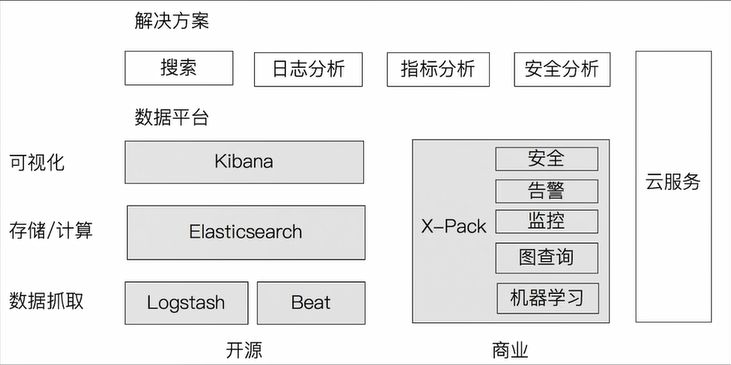

# Elasticsearch
## 部署
- 创建docker网络
`docker network create es`
- 创建`plugin`目录进行挂载
- 启动es
> 必须带有参数`--privileged=true`
```shell
docker run -it -d --privileged=true --name es --net es -p 9200:9200 \
-e "discovery.type=single-node" \
-e ES_JAVA_OPTS="-Xms512m -Xmx512m" \
-v ./es-data/plugins:/usr/share/elasticsearch/plugins \
-v ./es-data/data:/usr/share/elasticsearch/data \
elasticsearch:8.9.2
```
- 启动kibana
```shell
docker run -d --name kb --net es -p 5601:5601 kibana:8.9.2
```
- 通过`docker logs containerName 查看token和密码和验证码`
-------------------------------
> kibana版本和elasticsearch版本要一致

## 功能
- 支持水平扩展, `Restful Api`
- 海量数据的分布式存储
- 近实时搜索
- 海量数据的近实时分析(聚合)
- 
- logstash: 开源的服务器端数据数据处理管道
  - 实时解析和转换数据
  - 可扩展
  - 可靠性安全性
  - 监控
- kibana: 数据可视化
- beats: Go开发, 轻量的数据采集器
- 日志管理: 日志搜集, 格式化分析, 全文检索, 风险管理