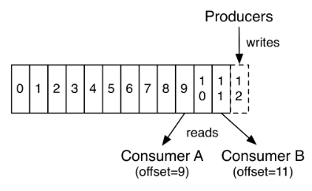
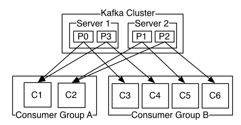

# KAFKA

## Introduction

- 流处理平台有以下三种特性
  1. 可以让你发布和订阅流式的记录。这一方面与消息队列或者企业消息系统类似.
  2. 可以储存流式的记录，并且有较好的容错性.
  3. 可以在流式记录产生时就进行处理.
- kafka适用场景
  1. 构造实时流数据管道，它可以在系统或应用之间可靠地获取数据. (相当于message queue)
  2. 构建实时流式应用程序，对这些流数据进行转换或者响应. (就是流处理，通过kafka stream topic和topic之间内部进行变化)
  3. 削峰,解耦,异步通信
- `kafka`中的topics是多订阅者模式,一个topic可以拥有一个或者多个消费者来订阅它的数据
  - 对于每一个topic,kafka集群都会维持一个分区日志, 每个分区都是有序且顺序不可变的记录集，并且不断地追加到结构化的`commit log`文件
  - 分区中的每一个记录都会分配一个id号来表示顺序, 称之为offset, offset用来唯一的标识分区中每一条记录
- `kafka`集群保留所有发布的记录(无论是否被消费),并有可配置参数:保留期限, 期限内可以随时被消费. `kafka`的性能和数据大小无关
- 
- 消费者可以采用任何顺序来消费记录,一个消费者的消费对集群或者其他消费者没多大影响
- 日志中的分区
  1. 当日志大小超过单台服务器的限制,允许日志进行扩展
  2. 每个单独的分区都必须受限于主机的文件限制
  3. 可以作为并行的单元集

### 分布式

- 日志的分区partition(分布)在Kafka集群的服务器上. 每个服务器在处理数据和请求时, 共享这些分区.
- 每一个分区都会在已配置的服务器上进行**备份**, 确保容错性.
- 每个分区都有一台 server 作为 `leader`, 零台或者多台server作为`follwers`. `leader server`处理一切对 partition(分区)的读写请求，而`follwers`只需被动的同步leader上的数据.
- 当leader宕机了，followers 中的一台服务器会自动成为新的`leader`. 
- 每台`server`都会成为某些分区的`leader`和某些分区的`follower`,因此集群的负载是平衡的.

## 生产者

- 生产者可以将数据发布到所选择的`topic`(主题)中。生产者负责将记录分配到topic的哪一个`partition`(分区)中

## 消费者

- 消费者使用一个 消费组 名称来进行标识，发布到topic中的每条记录被分配给订阅消费组中的一个消费者实例.
- 消费者实例可以分布在多个进程中或者多个机器上.
- 如果所有的消费者实例在同一消费组中，消息记录会**负载平衡**到每一个消费者实例.
- 如果所有的消费者实例在不同的消费组中，每条消息记录会广播到所有的消费者进程.
- 
- `kafka`只保证分区内的记录是有序的，而不保证主题中不同分区的顺序.
- 在`kafka`中实现消费的方式是将日志中的分区划分到每一个消费者实例上，以便在任何时间，每个实例都是分区唯一的消费者.
- 维护消费组中的消费关系由Kafka协议动态处理.
- 如果新的实例加入组，他们将从组中其他成员处接管一些`partition`分区;如果一个实例消失，拥有的分区将被分发到剩余的实例

## 保证

- 生产者发送到特定`topic partition`的消息将按照发送的顺序处理.
- 对于具有N个副本的`topic`, 我们最多容忍N-1个服务器故障, 从而保证不会丢失任何提交到日志中的记录.

## kafka作为消息系统

- 允许将消息广播给多个消费组,每条消息都会发送给所有的订阅者.
- 相比于传统消息队列具有更严格的顺序保证.
- 能够为一个消费者池提供顺序保证和负载平衡.
- 消费者组中的消费者实例个数不能超过分区的数量.

## kafka作为存储系统
- 数据写入Kafka后被写到磁盘，并且进行备份以便容错。直到完全备份，Kafka才让生产者认为完成写入，即使写入失败Kafka也会确保继续写入.
- Kafka使用磁盘结构，具有很好的扩展性—50kb和50TB的数据在server上表现一致.
- 可以认为是一种高性能、低延迟、具备日志存储、备份和传播功能的分布式文件系统

## kafka用作流处理
- 简单的数据处理可以直接用生产者和消费者的API. 对于复杂的数据交换, 提供了`Streams API`.

## 批处理
- 将消息,存储,流处理结合
- 可以存储用于批处理的静态数据
- 通过组合存储和低延迟订阅，流式应用程序可以以同样的方式处理过去和未来的数据

