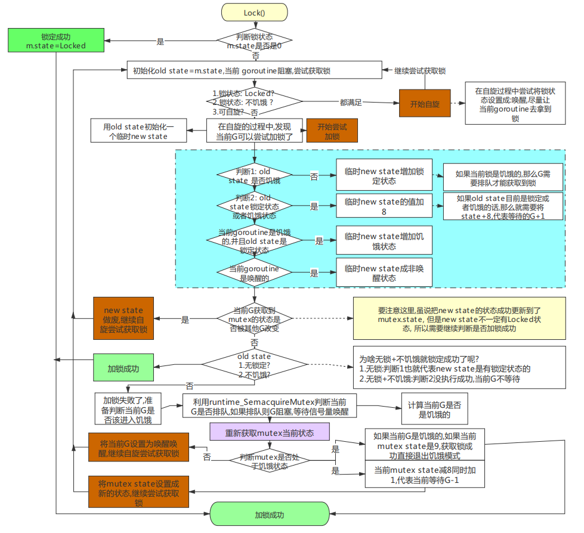
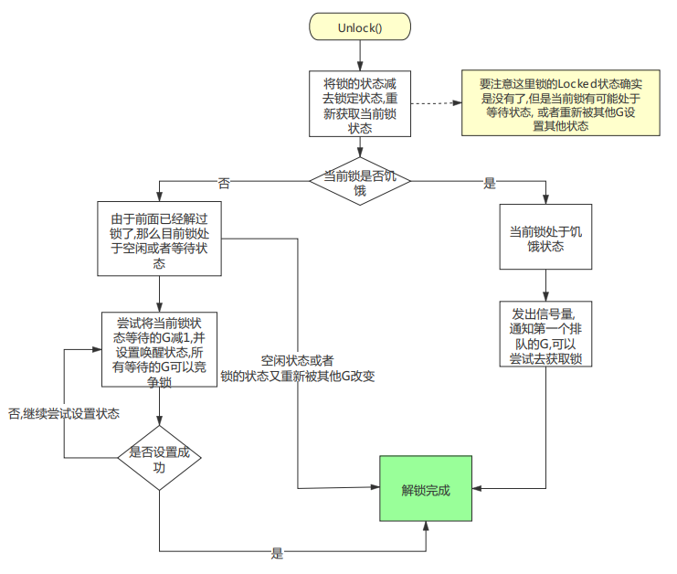

# `sync.Mutex`
## 结构
```go
package main
type Mutex struct {
	// state是一个复合型字段, 一个字段包含多个意义, 可以通过尽可能少的内存来实现互斥锁
	// mutexWaiters|mutexStarving|mutexWoken|mutexLocked
	state int32
	sema  uint32
}
const (
	mutexLocked = 1 << iota // mutex is locked
	// 当前是否已经存在被唤醒的goroutine, 因为mutex需要知道当前是否已经存在试图获取锁的goroutine
	// 存在的话就不用再额外去唤醒锁了, 因为唤醒了也是去竞争, 不如让运行中的goroutine直接拿到
	mutexWoken				// 2(10)
	mutexStarving			// 4
	mutexWaiterShift = iota // 3
	starvationThresholdNs = 1e6	// 饥饿模式1毫秒
)
```
## 方法
- 饥饿模式: 等待超过1ms
- 新来的goroutine和从队列唤醒的goroutine一起去抢锁, 唤醒按照先来先到的原则
- 没抢到不是直接去排队, 而是自旋
- 正常模式给新的goroutine机会, 一起去抢锁
- 饥饿模式照顾老的goroutine, 所有goroutine都排队, 按照队列顺序
```go
func (m *Mutex) Lock() {
	// Fast path: 幸运case, 直接获取到锁.
	// cas操作, 如果old是0, 说明四个标记位都为0没有在使用锁的, cas可以直接获取到锁, 将state设置为1, 即最后一位mutexLocked为1, 表示已经被占有了
	if atomic.CompareAndSwapInt32(&m.state, 0, mutexLocked) {
		if race.Enabled {
			race.Acquire(unsafe.Pointer(m))
		}
		return
	}
	// 单独抽出一个放到一个函数里, 方便fast path被内联
	m.lockSlow()
}
func (m *Mutex) lockSlow() {
	// ! 进到lockSlow时, state的lock位一定是1, 表示已经上锁了
	var waitStartTime int64	// 请求锁的初始时间
	starving := false	// 此goroutine的饥饿标记
	awoke := false		// 唤醒模式标记
	iter := 0			// 自旋次数
	old := m.state 		// 保存当前锁的状态
	for {
		// 锁是非饥饿状态, 锁还没被释放, 尝试自旋
		// mutexLocked | mutexStarving: 按位或运算
		/*
		state: waiter|starving|woken|locked
		mutexLocked是1(001)
		mutexStarving是4(100)
		mutexLocked|mutexStarving = 101
		old&101 => 的结果取决于old的starving和locked位, 因为只有这俩是1(按位与), 前面的都要补0, 然后locked是1, 就取决于starving了
		如果这个最终结果 == mutexLocked(1), 那么starving只能是0, 表示处于饥饿状态
		! old&(mutexLocked|mutexStarving)作用是判断是否处于饥饿状态, 拿到starving位的值
		! old&mutexWoken作用是判断是否有被唤醒的goroutine, 因为结果取决于old的woken位的值
		! old&mutexStarving作用是判断是否处于饥饿模式
		*/
		// 如果上了锁然后不是饥饿状态, 还可以自旋, 对正常状态抢锁的goroutine尝试自旋 (首次进入lockSlow时state的woken位是0, 处于非唤醒状态)
		if old&(mutexLocked|mutexStarving) == mutexLocked && runtime_canSpin(iter) {
			// 没有唤醒的goroutine && 不是唤醒模式 && waiter不为0(old>>mutexWaiterShift是右移3位正好得到Waiter数量) && cas成功(old|mutexWoken的结果是将Woken标记为1) 
			if !awoke && old&mutexWoken == 0 && old>>mutexWaiterShift != 0 && atomic.CompareAndSwapInt32(&m.state, old, old|mutexWoken) {
				// 设置为唤醒模式, 尽量让当前goroutine取拿到锁
				awoke = true
			}
			// 自旋等待, 目的是不直接挂起, 有可能锁马上就会释放
			runtime_doSpin()
			iter++
			old = m.state	// 再次获取锁的状态，之后会检查是否锁被释放了
			continue
		}
		new := old
		// 所有goroutine的目的都是获取锁, 但是如果当前处于饥饿状态, 则都不允许, 统统去排队.
		
		// 非饥饿状态抢锁
		// mutexStarving为100, 按位与的结果取决于old的starving位的值
		if old&mutexStarving == 0 {
			new |= mutexLocked	// 非饥饿状态, 加锁
		}
		// 如果锁被持有, 或者处于饥饿状态, 那么waiter+1, new+8
		if old&(mutexLocked|mutexStarving) != 0 {
			new += 1 << mutexWaiterShift
		}
		// !因为是饥饿goroutine, 所以设置饥饿状态
		// 如果锁被持有, 并且goroutine进入饥饿模式, 那么切换mutex为饥饿状态, 要求mutex按照饥饿模式执行
		if starving && old&mutexLocked != 0 {
			// 切换为饥饿模式
			// 按位或操作(100)
			new |= mutexStarving
		}
		// 如果有唤醒的
		if awoke {
			// goroutine已经被唤醒, 是清醒的. 所以需要重置标志位
			if new&mutexWoken == 0 {
				throw("sync: inconsistent mutex state")
			}
			new &^= mutexWoken	// 新状态清除唤醒标志
		}
		if atomic.CompareAndSwapInt32(&m.state, old, new) {
			// 老状态没上锁并且处于正常模式, 那么一定上锁成功
			// 老状态没上锁, 但是是饥饿模式, 需要排队等候
			if old&(mutexLocked|mutexStarving) == 0 {
				break // locked the mutex with CAS
			}
			// 如果是等待过的goroutine, 则进入队列头部, 之后会优先出队
			queueLifo := waitStartTime != 0
			if waitStartTime == 0 {
				waitStartTime = runtime_nanotime()
			}
			// 进入休眠, 把自己放入头部, 等待被唤醒
			runtime_SemacquireMutex(&m.sema, queueLifo, 1)
			// 被唤醒, 先判断是否应该进入饥饿状态
			starving = starving || runtime_nanotime()-waitStartTime > starvationThresholdNs
			old = m.state
			// 如果锁处于饥饿模式,那么被唤醒的协程是一定能拿到锁的.
			// 注意上面的饥饿状态,协程进入饥饿状态不代表锁进入饥饿模式,需要这个饥饿状态的锁把锁设置成饥饿模式才行.
			// 这里实际是一个手递手的过程
			
			// 如果处于饥饿状态, 直接抢到锁, 返回
			if old&mutexStarving != 0 {
				// 不可能的状态预警
				if old&(mutexLocked|mutexWoken) != 0 || old>>mutexWaiterShift == 0 {
					throw("sync: inconsistent mutex state")
				}
				// waiter-1和上锁
				delta := int32(mutexLocked - 1<<mutexWaiterShift)
				// 如果不是饥饿状态, 或者waiter为1
				if !starving || old>>mutexWaiterShift == 1 {
					// 清除饥饿标记
					delta -= mutexStarving
				}
				atomic.AddInt32(&m.state, delta)
				break
			}
			awoke = true
			iter = 0
		} else {
			old = m.state
		}
	}

	if race.Enabled {
		race.Acquire(unsafe.Pointer(m))
	}
}

func (m *Mutex) Unlock() {
	if race.Enabled {
		_ = m.state
		race.Release(unsafe.Pointer(m))
	}
	
	new := atomic.AddInt32(&m.state, -mutexLocked)
	if new != 0 {
		m.unlockSlow(new)
	}
}

func (m *Mutex) unlockSlow(new int32) {
	// 没有加锁, 直接解锁,state为-1
	if (new+mutexLocked)&mutexLocked == 0 {
		fatal("sync: unlock of unlocked mutex")
	}
	// 正常状态
	// 与操作获得的是Starving位的值
	if new&mutexStarving == 0 {
		old := new
		for {
			// 如果此时没有协程在等待,就不用唤醒了
			// 或者 锁马上被持有了 也不用唤醒了 交给持有者去判断
			// 或者 存在醒着的协程 也不用唤醒了 唤醒了也是去竞争
			// 或者 到这里是饥饿模式 那饥饿协程应该已经拿到锁了
			if old>>mutexWaiterShift == 0 || old&(mutexLocked|mutexWoken|mutexStarving) != 0 {
				return
			}
			// waiter数量-1
			new = (old - 1<<mutexWaiterShift) | mutexWoken
			if atomic.CompareAndSwapInt32(&m.state, old, new) {
				runtime_Semrelease(&m.sema, false, 1)
				return
			}
			old = m.state
		}
	} else {
		// 处于饥饿状态, 直接唤醒等待队列中的waiter
		// 发出信号量通知第一个排队的goroutine
		runtime_Semrelease(&m.sema, true, 1)
	}
}
func (m *Mutex) TryLock() bool {
	old := m.state
	// 如果锁被持有或者处于饥饿状态, 返回false
	// 饥饿状态下说明有goroutine即将要获得锁
	if old&(mutexLocked|mutexStarving) != 0 {
		return false
	}
	// 如果state==old, 将其变为上锁状态, 返回true
	// 如果不等于, 就不能上锁成功, 说明state正在被使用
	// 尝试加锁
	if !atomic.CompareAndSwapInt32(&m.state, old, old|mutexLocked) {
		return false
	}

	if race.Enabled {
		race.Acquire(unsafe.Pointer(m))
	}
	return true
}
```

- 
- 