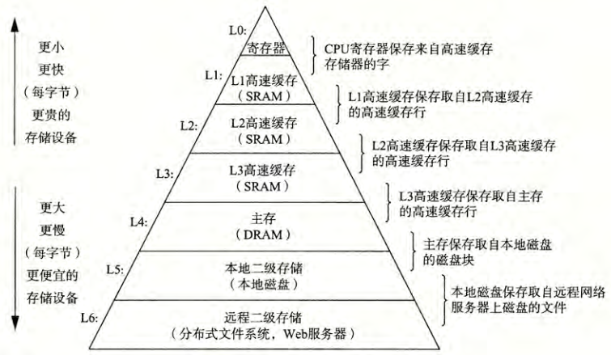
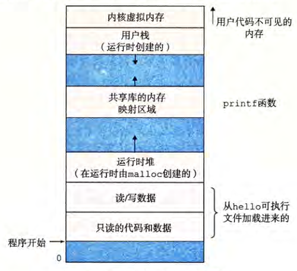

# chapter1
> 计算机系统漫游
- 信息就是位+上下文
- `gcc -o hello hello.c`
  - 预处理器: 根据以字符#开头的命令, 修改原始的C程序, 将头文件中的内容直接插入程序文本中->`hello.i`
  - 编译器(ccl): 将文本文件`hello.i`翻译成文本文件`hello.s`, 包含一个汇编语言程序
  - 汇编器(as): 将`hello.s`翻译成机器语言指令, 将结果保存在目标文件`hello.o`中
  - 链接器(ld): 将`printf.o`和`hello.o`合并, 得到一个可执行目标文件
- `shell`是一个命令行解释器
- 系统硬件组成: 总线(传送定长的字(word), 64位: 8个字节), I/O设备, 主存, 处理器(加载, 存储, 操作, 跳转)
- 直接存储器读取(DMA)技术: 数据可以不通过处理器而直接从磁盘到达主存
  - 
- 操作系统的两个基本功能(通过抽象来完成:进程->处理器,主存和I/O设备的抽象, 虚拟内存->主存和磁盘I/O设备抽象, 文件->I/O设备抽象)
  1. 防止硬件被失控的应用程序滥用
  2. 向应用程序提供简单一致的机制来控制复杂而又通常大不相同的低级硬件设备
- **进程是操作系统对一个正在运行的程序的一种抽象**
- **操作系统保持跟踪进程所需的所有状态信息, 即上下文(PC和寄存器文件的当前值, 以及主存的内容)**
- 虚拟内存是一个抽闲概念, 它位每个进程提供了一个假象, 即每个进程都在独占地使用主存. 每个进程看到的内存都是一致的, 称为虚拟空间地址.
- 
- Amdahl定律(阿姆达尔)
  - 当我们对系统的某个部分加速时, 其对系统整体性能的影响取决于该部分的重要性和加速程度.
  - 要想显著加速整个系统, 必须提升全系统中相当大的部分的速度.