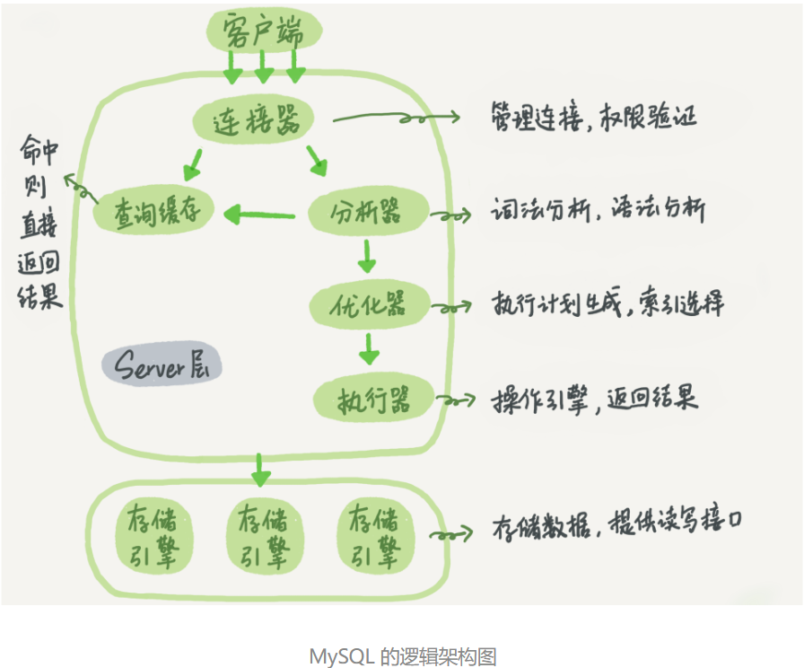
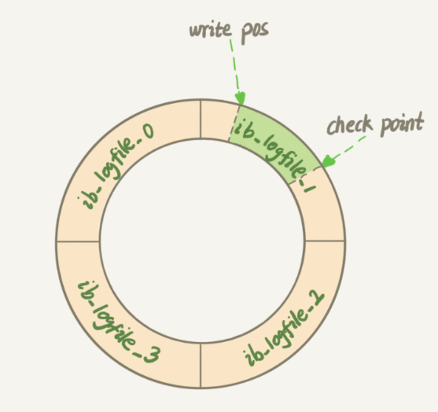
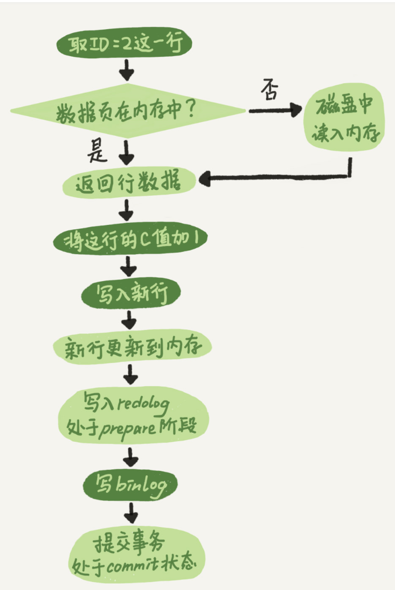

# 01| 基础架构: 一条SQL查询语句是如何执行的
- 
- server层涵盖MySQL的大多数核心服务功能, 以及所有内置函数, 所有夸存储引擎的功能都在这一层实现.
- 存储引擎负责数据的存储和提取, 是插件式的.
- 一个表上有更新的时候, 跟这个表有关的查询会失效.
# 02| 日志系统: 一条SQL更新语句是如何执行的
- 更新流程设计两个重要的日志模块
  - redo log(重做日志), 是物理日志, 是循环写的.
  - binlog(归档日志), 是逻辑日志, 记录的是这个语句的原始逻辑. 是追加写的.
- 如果每一次更新操作都需要写进磁盘, 然后磁盘也要找到对应的那条记录, 然后再更新, 整个过程IO成本, 查找成本都很高.
- WAL(writer-ahead logging): 先写日志再写磁盘
  - 当有一条记录需要更新的时候, InnoDB引擎就会先把记录写到redo log里面, 并更新内存, 此时更新算作完成
  - InnoDB引擎在适当的时候, 将这个操作记录更新到磁盘.
  - InnoDB的redo log是固定大小的.
  - 
  - write pos是当前记录的位置, checkpoint是当前要擦除的位置.
  - redo log使得及时数据库异常重启, 之前提交的记录都不会丢失, 这个能力称为crash-safe. 是InnoDB引擎独有的. 
- binlog是server层特有的日志.
- 
- 两阶段提交, 以下两种方式, 如果第一个写完了, 然后崩溃了, 会导致回复时数据不一致.
  - 先写redo log后写binlog
  - 先写binlog 后写redo log
- redo log的写入拆成了两个步骤: `prepare`和`commit`
- 参数
  - `innodb_flush_log_at_trx_commit`, 每次事务的redo log直接持久化到磁盘
  - `sync_binlog`: 每次事务的binlog都持久化到磁盘.
- 保证数据库的一致性, 需要两份日志一致.

# 03| 事务隔离: 为什么你改了我还看不见
- 保证一组数据库操作, 要么全部成功, 要么全部失败. 事务支持在引擎层实现.
- 隔离性(ACID)
  - 原子性: atomicity
  - 一致性: consistency
  - 隔离性: isolation
  - 持久性: durability
- 多个事务同时执行
  - 脏读: dirty read
  - 不可重复度: non-repeatable read
  - 幻读: phantom read
- 隔离级别
  1. 读未提交: read uncommitted, 一个事务还没提交时, 做的变更就被能给其他事务看到
  2. 读提交: read committed, 一个事务提交之后, 做的变更才会被其他事务看到
  3. 可重复读: repeatable read, 一个事务在执行期间看到的数据前后是一致的. 未提交变更对其他事务是不可见的.
  4. 串行化: serializable, 对于同一行记录, 会加读写锁, 冲突时, 后访问的事务必须等前一个事务执行完成, 才会继续执行.
- 实现上, 数据库里面会创建一个视图, 访问时候以视图的逻辑结果为准.
- MySQL中, 每条记录在更新的时候都会同时记录一条回滚操作. 记录上的最新值, 通过回滚操作, 都可以得到前一个状态的值.
  - 回滚日志删除: 没有事务再需要用到这些回滚日志时, 会被删除.
- 长事务意味着系统里面会存在很老的事务视图.
- 显示启动事务.

# 04| 深入浅出索引(上)
> 提高数据查询效率
- 索引模型
  - 哈希表: 适用于等值查询的场景
  - 有序数组: 适用于静态存储引擎(更新数据麻烦)
  - 搜索树: N叉树读写性能好, 适配磁盘的访问模式.
## InnoDB
- 表都是根据主键顺序以索引的形式存放的, 这种存储方式的表成为索引组织表.
- 每一个索引在InnoDB中对应一棵B+树.
- 根据叶子结点的不同, 索引类型分为主键索引和非主键索引
  - 主键索引(聚簇索引): 叶子结点存的是整行数据.
  - 非主键索引(二级索引): 叶子结点内容是主键的值.
- 基于非主键索引的查询需要多扫描一棵索引树(回表)
## 索引维护
- B+树为了维护索引有序性, 插入新值需要做维护, 出现以下情况
  - 页分裂(n和n+1之间插入值), 申请新的数据页, 挪动数据, 影响数据页的利用率.
  - 合并, 相邻两个叶删除了数据, 利用率很低之后, 会合并.
- 主键长度越小, 普通索引的叶子结点就越小, 普通索引占用的空间也就越小.
  - 以身份证号为例, 如果身份证号是主键, 那么每个二级索引的叶子结点占用空间明显大于int
- 业务字段直接做主键的场景
  - **只有一个索引**
  - **该索引必须是唯一索引**
- `alter table T drop index k;`
- `alter table T add index(k);`
- `alter table T drop primary key;`
- `alter table T add primary key(id);`

# 05| 深入浅出索引(下)
- 回到主键索引树搜索的过程, 成为回表.
- 覆盖索引(二级索引覆盖查询需求): 可以减少树的搜索此处, 显著提高查询性能, 使用覆盖索引是一个常用的性能优化手段.
  - 联合索引: 市民表, 需要根据身份证号查询姓名, 所以可以建立身份证号和姓名的联合索引, 能用到覆盖索引, 不需要回表查整行数据.
- 最左前缀原则
  - B+树这种索引结构, 可以利用索引的最左前缀, 定位记录.
  - 不只是索引的全部定义, 只要满足最左前缀, 就可以利用索引来加速检索. 可以使联合索引的最左N个字段, 也可以是字符串索引的最左M个字符.
  - 有了(a,b)这个联合索引, 一般就不需要在a上建立索引了.
  - **如果通过调整顺序可以少维护一个索引, 那么这个顺序往往是需要优先考虑采用的**
- 索引下推: 在索引遍历过程中, 对索引中包含的字段先做判断, 直接过滤掉不满足条件的记录, 减少回表次数.
- 重建索引的过程会创建新的索引, 提高页面利用率, 使得索引更紧凑, 更省空间.
- 删除表的部分记录, 索引还在(会浪费空间).

# 06| 全局锁和表锁: 给表加个字段怎么有这么多阻碍
- 根据加锁范围, 大致分为全局锁, 表级锁, 行锁
- 全局锁
  - 对整个数据库实例加锁`Flush tables with read lock`(FTWRL), 让整个库处于只读状态. 
  - 典型使用场景是做**全库逻辑备份**
  - 可以开启可重复度事务确保拿到 一致性视图.
  - 全部是InnoDB引擎的库, 建议使用`single-transaction`, 只适用于所有的表使用事务引擎的库.
- 表级锁
  - 表锁(`lock tables ... read/write`)
  - 元数据锁(MDL, `metadata lock`), 访问一个表的时候会自动加上, 保证读写正确性.
- mdl直到事务提交才释放.
- 理想机制是设定等待时间, 指定时间拿到mdl写锁.

# 07| 行锁功过: 怎么减少行锁对性能的影响
- 行锁在引擎层实现, InnoDB支持, MyISAM不支持, 不支持意味着并发控制只能使用表锁.
- 在InnoDB事务中, 行锁是在需要的时候才加上的, 但并不是不需要了就立刻释放, 而是要等到事务结束时才释放. 这个就是两阶段锁协议.
- 如果事务中需要锁多个行, 要把最可能造成锁冲突, 最可能影响并发度的锁尽量往后放.
- case
  1. 从顾客 A 账户余额中扣除电影票价
  2. 给影院 B 的账户余额增加这张电影票价
  3. 记录一条交易日志
  - 如果多个顾客买票, 两个事务冲突部分就是语句2, 所以语句2尽量放到最后. 影响余额这一行的行锁在一个事务中不会停留很长时间.
## 死锁和死锁检测
- 
- A等待B释放id=2的行锁, B等待A释放id=1的行锁, A和B互相等待对方的资源释放.
- 策略
  - 直接进入等待, 直到超时, 超时时间参数: `innodb_lock_wait_timeout`
  - 发起死锁检测, 发现死锁后, 主动回滚死锁链条中的某一个事务, 让其他事务得以继续执行. 将参数`innodb_deadlock_detect`设置为on.
    - 主动死锁检测有额外负担, 每当一个事务被锁的时候, 就要看看它锁依赖的线程有没有被其他锁住 如此循环, 最后判断是否出现了循环等待.
    1. 临时把死锁检测关闭
    2. 控制并发度
    3. 将一行改成逻辑上的多行来减少锁冲突. 例如将影院账户金额分为10个记录的值的总和, 然后在业务上做详细设计.     
